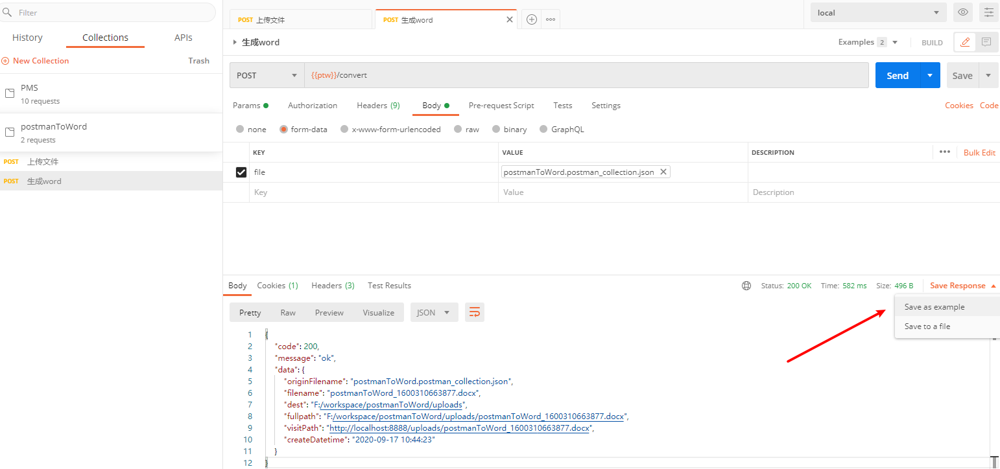
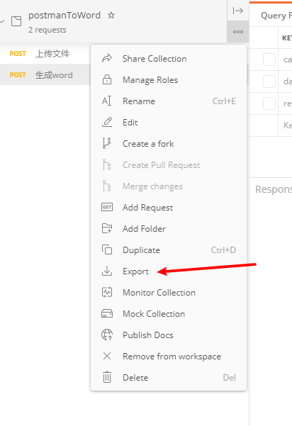
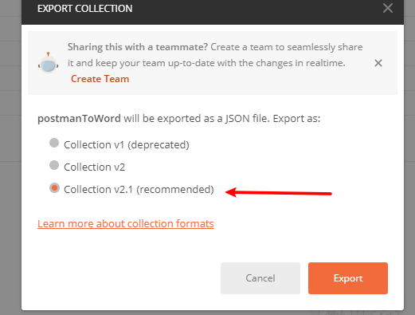
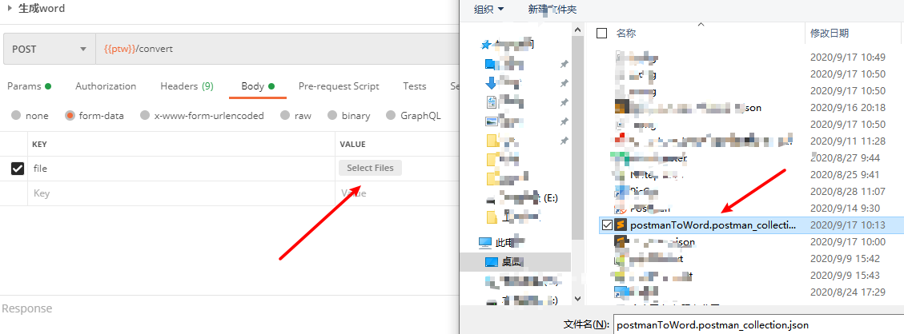

# postmanToWord
很懒，不喜欢写接口文档。现在开发用的是postman调接口，所以就开发这个工具方便大家快速的把postman导出的json转成标准的接口文档。  :laughing:  :laughing: 

[](https://travis-ci.org/zhexiao/office-parser)
[](https://codecov.io/gh/zhexiao/office-parser)


## postman
Postman导出Collection v2.1类型的JSON文件转为WORD标准接口文档

### 操作流程
1. postman请求接口并保存返回结果为一个example



2. 为example命令，一般一个成功的返回和一个失败的返回即可


3. 导出这个接口所属的Collection



4. 导出v2.1版本



5. 运行这个项目，并调用convert接口把json转换成word接口文档



6. 调用convert接口会返回一个对象，核心请求数据在visitPath


7. 打开visitPath链接地址，会下载一个接口文档word


## 核心自定义配置
application.yml
```yaml
app:
  fileDest: "F:/workspace/postmanToWord/uploads"
  filePathRoute: "/uploads/" # 上传的访问地址
  fileVisitHost: "http://localhost:8888" # 上传的文件地址访问主机名
```